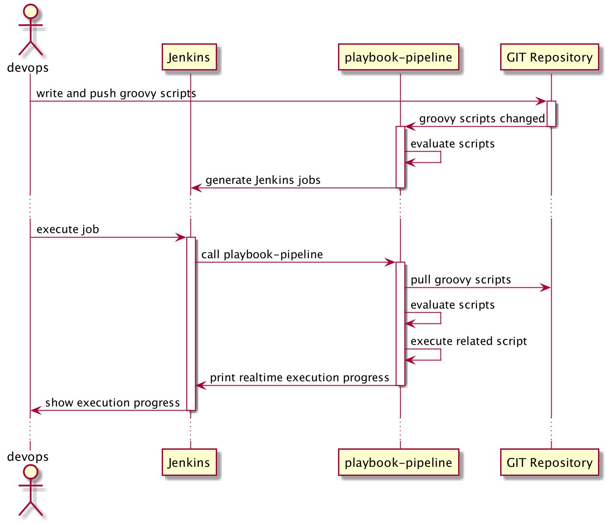
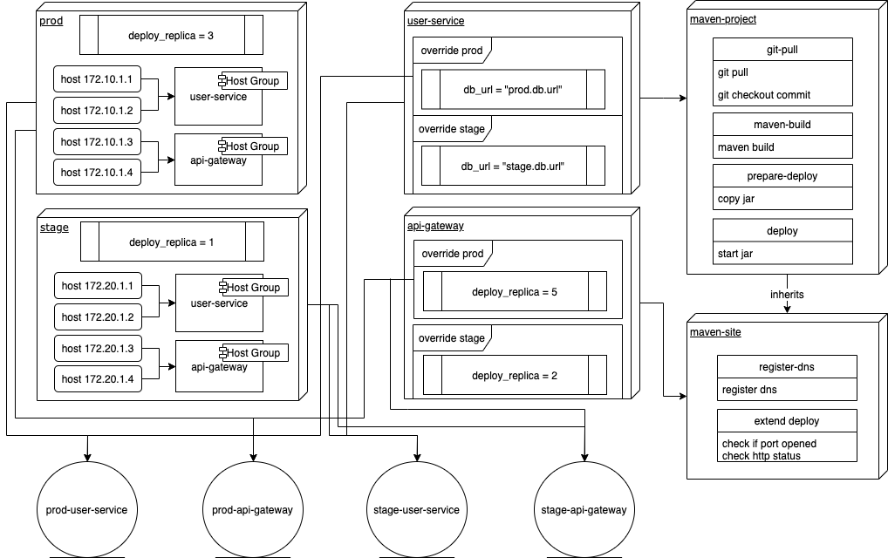

# pipeline-playbook

pipeline-playbook是一款用于协助开发运维人员（devops）进行日常运维工作的Jenkins插件。

## 1. 背景与需求

在本章中我们对运维人员日常工作中遇到的问题和痛点进行分析，以确定pipeline-playbook需要做哪些事情。我们着重讨论运维人员日常要做的两大事情：维护数据和维护脚本。

### 1.1. 运维需要维护的数据

开发运维人员在日常工作中经常和一些基本数据打交道，例如环境、项目和配置，这些基本信息之间有复杂的相关性，而且数据量又非常之多。
并且由于关乎整个系统的运行状况和开发测试的整体进度，这些数据的数据又非常重要，容不得差错。
另外，随着业务更迭，这些数据又会经常发生变化，因此需要对其进行长期维护。

这些基本信息包括：

* 环境信息：生产环境、测试环境，以及各个环境之间的关系和对环境进行分类。由于开发和测试需要，测试环境往往不只一个，但是多个测试环境之间又存在某些共性。
   这些信息需要表达出来。
* 项目信息：由于开发需要，一个系统可能有很多个项目组成（例如微服务架构），这些项目都要求能够进行独立的编译和部署。
   某些项目具有一些共性，例如同为java项目或同为npm项目；某些项目需要部署多个副本，而某些项目只能部署一个副本
* 配置信息：例如数据库链接、账户密码和公私钥等配置。同一个配置在不同的环境不同的项目下可能会不一样，例如部署的副本数，为了节省成本，
   在测试环境可能只需要部署一个副本，但是在生产环境要部署多个副本，又由于重要程度不同，同在生产环境不同的项目的部署副本也会不同。
  
为了帮助运维人员从繁杂的数据维护工作中解脱出来，我们需要一种简单方便的方式或者工具对这些数据进行描述。这个工具或者方式需要满足以下要求：

1. 对数据的表述足够简单清晰，可读性要高。  
   例如可以很容易看到当前有哪些环境、哪些配置，每个配置的值是多少
   
2. 方便对数据进行修改。  
   例如可以很简答地修改某个配置的值
   
3. 能够对数据变更进行跟踪。  
   由于运维维护的这些数据非常重要，对数据的微小修改可能会导致巨大的影响，因此必须能够对数据变更做回溯，以便快速回滚或者定位问题。
   
4. 尽可能减少冗余数据。  
   冗余信息普遍存在于devops面临的基础数据中，例如各测试环境共享的一些配置（数据库、账号等），某些项目之间共享的一些配置等。
   由于各个项目在各个环境下有可能有不同的配置值，如果我们为这个笛卡尔积中的每个"环境-项目"维护一份完整的配置，那么这些配置将会极度冗余。
   过渡冗余的数据会导致信息修改变地非常难以进行，大大增加了数据维护的成本。
   
5. 能够清晰表达数据中的某些关系。  
   例如环境之间的相似性、项目与环境的关系、同一份配置在哪些项目哪些环境的值是一致，又在哪些环境哪些项目下不一致。
   某些配置之间是否有关联性（例如数据连接字符串和数据主机地址）。这些关系必须要能表述清楚，这样才有利于我们书写、理解和维护它们。
   
6. 支持敏感信息保护。  
   运维人员日常维护的数据不仅复杂，有时候还很敏感。有些敏感信息（例如账号密码、私钥等）需要存储和维护，但是为了防止泄漏，又不能明文存储，需要对其进行加密保护，仅在使用的时候再解密。
   另外，为了增加可读性，不应对不敏感的信息进行加密保护，更不幸的是，某些敏感的配置和不敏感的配置存在相关性，这些问题都需要解决。

### 1.2. 运维需要维护的脚本

脚本是我们自动执行一些运维任务的工具，包括下载并编译代码、部署编译结果等。由于运维的巨大工作量，需要维护的脚本的量也会非常大。
为了提高脚本编写的效率和降低运维人员的维护成本，我们需要一种编写维护脚本的工具或者方式满足以下要求：

1. 脚本语法应清晰易懂，方便编写

2. 脚本应是完备的编程语言，能够表达复杂的条件和循环以及函数抽象，简单的基于配置文件的陈述式语言虽然易懂，但是难以满足复杂的业务场景

3. 当用于项目编译部署时，脚本应能够方便地使用当前项目和环境的配置

4. 脚本之间应能够复用，一个脚本可以通过其他几个脚本的组合进行实现

5. 脚本的执行效率应比较高

6. 脚本应可以拆分为多个步骤，每个步骤应具备可复用性，并且这些步骤均可设置是否跳过、是否自动重试，是否并自动发执行等细粒度设置

7. 脚本应为远程友好型，即能够方便在远程机器上执行操作。由于运维工作的特殊性，我们的大量脚本都围绕着在远程机器上执行命令行、拷贝文件等，这些操作应是框架的一部分。

## 2. 设计思路与基本概念

基于上一章关于运维工作的特征，我们开发了pipeline-playbook插件。在本章中我们讨论pipeline-playbook中的设计思路和基本概念。

### 2.1. 设计思路

对于运维要维护的数据，我们需要有非常好的描述基本信息的工具。而领域描述语言（DSL）正是为了清晰表述概念而生，因此我们从DSL出发，找到了把DSL作为一等公民的
脚本语言Groovy。

Groovy是一款基于JVM虚拟机的脚本编程语言，擅长概念描述，又具备很高的可编程性，并且由于运行在JVM平台，能够利用到强大的Java生态系统，所以它也是完备的。

因此我们选择Groovy作为描述运维数据和运维脚本的基础语言。

在选择Groovy之后，pipeline-playbook要做的就是按照Groovy的语法定义一组DSL，用于方便运维描述数据、数据之间的关系，脚本以及脚本之间的关系。
运维要做的就是编写和维护一组Groovy脚本。pipeline-playbook宿主于Jenkins中，接收这组Groovy脚本，并对其进行解析。
根据解析结果，自动生成相应的Jenkins Job，然后由devops在Jenkins页面上执行特定的Job，并最终执行相应的脚本。

为了支持变更回溯，我们使用GIT托管Groovy脚本。

以下是上述思路的设计图

### 2.2. 顶层结构与概念

在分析完需求之后，我们正式进入pipeline-playbook世界。为了便于表述，我们先介绍一些基本概念。

#### 2.2.1. 环境 environment, env  

环境指的是能够运行一套系统的具有特定用途的所有资源的集合，包括主机和配置。例如生产环境和测试环境。一般每个环境都有自己的一套域名。
环境分为抽象环境和具体环境，抽象环境用于抽象某些环境的共性，可以被其他抽象环境或者具体环境所继承。
  
在Groovy脚本中，每个环境使用一个单独的groovy文件来定义，其环境名由groovy文件的文件名决定。

#### 2.2.2. 主机 host  

主机指的是某个环境中的一台机器，可以是物理机器，也可以是一台运提供商的虚拟机，每个主机都必须配置它的地址。目前仅支持装有Linux系统的主机。、
  
#### 2.2.3. 主机组 host group  

为了管理方便，我们一般会将某些主机放置于同一个组下，称之为主机组。主机组既可以直接包含主机，也可以继承其他主机组。

#### 2.2.4. 项目 project

项目是一个抽象概念，表示独立于环境之外的运维单位。它可以很具体，表示一个后端项目或者一个前端项目，这些项目包含有源代码，并且可以编译和部署；
它也可以很抽象，表示某个数据库的备份这件事，也可以只是一个纯粹的配置集合。结合作业（Job）会让你对它有更深入的理解。
和环境一样，项目也分为抽象项目和具体项目，抽象项目用于抽象出某些项目之间的共性，可以被其他抽象项目或者具体项目所继承。
  
项目可以定义自己的变量，也可以定义在某些环境下才生效的变量，称之为`override`。通过这种方式，我们可以实现同一个项目在不同环境下拥有不同的配置。
  
#### 2.2.5. 闭包 closure

闭包是Groovy的概念，表示一段由Groovy语言编写的可执行代码。闭包是Groovy实现领域描述语言（DSL）的核心手段。
闭包类似于一个Java函数，但是可以作为参数传递，也可以保存到变量中，使得操作逻辑像操作数据一样方便。
  
#### 2.2.6. 变量 variable, var  

变量用于描述配置信息，由变量名和变量值两部分组成。每个环境或者每个项目中均可以定义变量，同名变量按照预定义的覆盖优先级相互覆盖。
例如我们在某个环境中定义变量`a = 1`，而在某个项目中覆盖这个变量`a = 2`，那么在这个环境的这个项目下，变量`a`的值为`2`。
  
变量可以是数字、字符串这样的简单类型，可以是一个集合、映射，也可以是一个延迟计算的闭包，也可以表示闭包本身（后文会介绍两者的区别）。
一个变量的值如果可以由另外一个变量决定，那么可以将这个变量定义为一个表达式（闭包），闭包中可以引用其他变量。这种延迟计算的变量仅在变量求值时才去确定它的最终值。
如果延迟计算的成本较高，并且计算结果是固定的，那么可以将变量声明为可缓存的延迟计算闭包。默认不缓存计算结果。
  
变量可以定义在抽象环境或抽象项目中，也可以定义在具体环境或具体项目中，如果同时出现在这两个地方，则表示使用具体环境/项目中的定义覆盖抽象环境/项目中的定义。
这种设计可以实现配置的泛化和特化。后文会对复杂场景下的变量优先级覆盖进行详细解释。
  
#### 2.2.7. 用户参数 user parameter  

用户参数是一种特殊类型的变量，能够影响生成Jenkins Job的过程，使其显示在被生成的Job的页面中，作为该Job的参数。devops执行job时可以设置它的值，从而对脚本的执行进行定制。
  
#### 2.2.8. 剧本 playbook  

剧本是实现运维自动化的载体和容纳各种自动化脚本的容器。每个项目均可以关联一个剧本，用于指定这个项目的执行流程（例如编译部署过程）。
每个剧本均可以包含多个剧幕，一个剧本也可以继承一个或多个剧本。
  
在Groovy脚本中，每个剧本使用一个单独的groovy文件来定义，其剧本名由该groovy文件的文件名决定。
  
剧本定义了具体的执行流程，属于可执行代码范畴。这些代码在执行的过程中需要一些配置支持，我们通过在剧本中定义变量来实现这一点。
实际上，剧幕也支持定义变量。通过多层的变量定义和覆盖策略，我们可以实现对执行流程的细粒度控制。
  
#### 2.2.9. 剧幕 play  

剧幕表示剧本中的一个大的阶段，对于一个后端Java项目来说，一个剧本可以包括下载代码、编译、部署等阶段，其中每个阶段均是一个剧幕。
  
当一个剧本继承了另外一个剧本时，这个剧本实际上继承另外一个剧本的所有变量和剧幕。子剧本可以通过定义同名剧幕的方式覆盖父剧本中的剧幕，也可以选择对父剧本中的剧幕进行扩展，以加入更多的任务。
  
剧幕中可以定义变量，一般用于定义用户参数。
  
剧幕可以配置目标主机。剧幕将为配置的每一台机器执行一次，并在不同的执行过程中通过上下文参数暴露当前执行所关联的目标主机。可以通过设置并发系数来控制这些执行的并发力度。
通过这种方式我们可以实现并发部署。
  
#### 2.2.10. 任务 task  

任务是可执行代码的最小单位。每个剧幕均由零个或多个任务组成。任务由任务名称、可执行闭包、执行条件、失败后的重试次数、tag等信息组成。
每个剧幕中的所有任务是通过森林结构进行组织的，每个剧幕直接包含一组任务，其中每个任务又可以包含一组子任务，而这些任务又可以各自包含它们的子任务。
  
任务在执行之前会进行条件预判，仅当预判通过后才会执行这个任务，如果一个任务被判定需要跳过，那么它的所有子任务均会被跳过。
  
#### 2.2.11. 情景 scene  

每个项目均关联到一个剧本上，而一个剧本又包括了多个剧幕，在job的执行过程中我们需要确定到底哪些剧幕需要执行，按照什么样的顺序执行。
为了回答这个问题，我们引入了概念`情景`。每个情景包括一组剧幕的名称，和要跳过的任务的tag集合。换句话说情景规定了哪些剧幕要执行，按照什么样的顺序执行，以及哪些任务要跳过。
  
从设计上说一个剧本可以支持定义多个情景，但是目前只用到了默认情景。
  
#### 2.2.12. 作业 job  

我们把所有项目和所有环境进行组合，得到了一组所谓的`project-env`组合，表示每个项目在每个环境下的实际状态，这种组合称之为作业（`Job`）。
  
Job表示处于某个特定环境下的项目。Job是计算的结果，由项目和环境共同决定，无法对其直接修改。每个job均包含一组变量的定义，这些变量是这个job对应的环境和项目在层级覆盖之后的最终结果。
  
单纯的项目是无法执行的，但是job可以执行。`pipeline-playbook`在发现groovy scripts变更之后会计算出所有的job，并根据这些job的信息生成对应的Jenkins job。
  
只有具体的环境和具体的项目的组合才能生成job。项目可以配置只在某些环境生成job。Job是可以直接执行的，不需要依赖于Jenkins。
  
#### 2.2.13. Jenkins Job  

Jenkins Job指的是Jenkins上的一个Job，是通往`pipeline-playbook`世界的入口点。每个Jenkins Job均可以定一组参数，这些参数在执行Job的Jenkins页面上以文本框、单选框、复选框和下拉框的形式显示出来。
用户在点击`Build`按钮之前可以设置这些参数，并在点击后将这些参数传递给`pipeline-playbook`。

### 2.3. 概念图

我们用一张图来总结上节的这些概念

